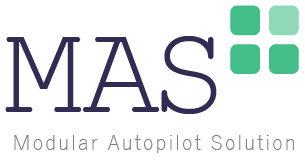

# MAS+ Modular Autopilot Solution

A repository to download the MAS+ environment for fast prototyping of Unmanned Aerial Systems and to exchange your customised functionalities.

 *Currently under construction. We apologize for any inconvenience.*

## Download and Installation
The basic MAS+ Simulink scheme can be downloaded **here**.
